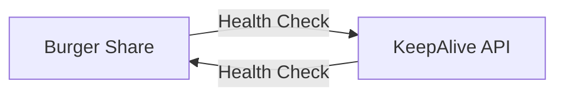

# Burger Share

A secure file-sharing platform built with Node.js and Express, utilizing jsonwebtoken (JWT) for enhanced security. Users can upload files and receive shareable links embedded with JWT tokens to ensure access control. The system features automatic cleanup of expired files, maintaining efficient storage management and ensuring data protection.
## 📋 Table of Contents
1. [Key Features](#key-features)
2. [Tech Stack](#tech-stack)
3. [Prerequisites](#prerequisites)
4. [Installation](#installation)
5. [Project Structure](#project-structure)
6. [Core Components](#core-components)
7. [API Endpoints](#api-endpoints)
8. [Deployment Strategy](#deployment-strategy)
9. [Security Measures](#security-measures)
10. [Development & Production](#development--production)
11. [Maintenance](#maintenance)
12. [Contributing](#contributing)

## Key Features

| Feature | Description |
|---------|-------------|
| Secure File Sharing | Upload files and receive time-limited, token-protected sharing links |
| Auto Cleanup | Automatic removal of expired files through scheduled CRON jobs |
| Token Security | JWT implementation for secure file access |
| Comprehensive Logging | Both file and console logging with detailed event tracking |
| Anti Spin-down | Innovative keep-alive system to prevent service interruption |

## Tech Stack

| Technology | Purpose |
|------------|----------|
| Node.js | JavaScript runtime environment for building scalable applications |
| Express.js | Web application framework for building RESTful APIs and handling HTTP requests |
| EJS | Templating engine for rendering dynamic HTML pages on the server side |
| JWT | JSON Web Tokens for secure authentication and authorization |
| Multer | Middleware for handling file uploads in Node.js applications |
| Node-cron | Task scheduler for running scheduled jobs, such as automatic file cleanup |
| Axios | Promise-based HTTP client for making requests, used for the keep-alive system |

## Prerequisites

- Node.js (v22.12.0 or higher)
- npm (v10.9.0 or higher)
- Git for version control
- Basic understanding of Express.js and JWT

> [!NOTE]
> The versions mentioned here reflect the environment in which the web app was developed. Compatibility with other versions may vary.

## Installation

1. Clone the repository:
   ```bash
   git clone https://github.com/daksh-deep/burger-share
   cd burger-share
   ```

2. Install dependencies:
   ```bash
   npm install
   ```

3. Configure environment variables:
   ```env
   PORT = 5000
   JWT_SECRET = <your_jwt_secret_key>
   JWT_EXPIRATION = 2h
   LOG_FILE = ./logs/logs.log
   CLEAN_DIR_PATH = ./uploads
   KEEP_ALIVE_URL = https://your-keepalive-api.onrender.com/health
   ```

## Project Structure

```
burger-share/
    ├── LICENSE
    ├── app.js
    ├── clean.js
    ├── package.json
    ├── Logger/
    │   └── logger.js
    ├── controllers/
    │   └── system.controller.js
    ├── middlewares/
    │   └── system.middleware.js
    ├── public/
    │   ├── CSS/
    │   │   └── global.css
    │   ├── fonts/
    │   │   ├── Mix-Light.woff2
    │   │   └── Mix-Regular.woff2
    │   └── images/
    ├── routes/
    │   ├── healthRoutes.js
    │   └── system.routes.js
    └── views/
        ├── 404_page.ejs
        ├── about.ejs
        ├── home.ejs
        ├── share_files.ejs
        ├── share_url.ejs
        └── partials/
            ├── back_nav.ejs
            └── navbar.ejs

```

## Core Components

### File Management System

| Component | Function |
|-----------|----------|
| Upload Handler | Processes incoming files and stores them temporarily |
| Token Generator | Creates unique JWT tokens for file access |
| Storage Manager | Moves files to token-specific directories |
| Cleanup Service | Removes expired files automatically |

### Automated Cleanup System
- CRON schedule: Every 2 hours
- Validates token expiration
- Removes expired directories
- Logs cleanup activities

### Logging System

| Log Level | Usage |
|-----------|-------|
| INFO | General operational logs |
| ERROR | System and operational errors |
| KEEP ALIVE | Heartbeat Signals |

## API Endpoints

| Endpoint               | Method | Description                               | Authentication | Expected Input                                           | Expected Output                                      |
|------------------------|--------|-------------------------------------------|----------------|---------------------------------------------------------|------------------------------------------------------|
| `/`                    | GET    | Home page                                 | None           | None                                                    | HTML response: `home` page rendered with details      |
| `/system`              | POST   | File upload                               | None           | **Form-data**: File to upload (e.g., via `multipart/form-data`) | HTML response: `share_url` page rendered with `{ shareableURL }` |
| `/system/:token`       | GET    | File sharing page                         | JWT Token      | **URL params**: `token` (JWT token)                     | HTML response: `share_files` page rendered with details about the shared files (e.g., file name & download link) |
| `/uploads/:token/:file`| GET    | File download                             | JWT Token      | **URL params**: `token` (JWT token), `file` (file name) | File stream: Requested file is returned for download |
| `/health`              | GET    | Heartbeat check                           | None           | None                                                    | JSON response: `{ message: "Keep-alive request received" }` to indicate system is Up and running |
| `*`                    | GET    | Undefined route                           | None           | None                                                    | HTML response: `404_page` rendered with `{ errorMessage: errorMessage }`  |


## Deployment Strategy

### Render.com Auto Spin-down Solution
When deploying web applications on Render.com's free tier, services automatically spin down after 15 minutes of inactivity. This can lead to undesirable delays for end-users as the application needs to restart upon receiving new requests.

To ensure continuous uptime, we've implemented a "Keep-Alive Feedback Loop" using two applications:

| Application | Purpose | Repository |
|------------|----------|------------|
| Burger Share (This repo) | Main file sharing application | [View Code](https://github.com/daksh-deep/burger-share) |
| Keep-Alive API | Uptime maintenance service | [View Code](https://github.com/daksh-deep/keepalive-api) |

#### System Architecture


The Keep-Alive API sends a request to our application every 10 minutes, and our application responds with a reciprocal health check, creating a continuous feedback loop that keeps both services active.

### Deployment Setup

1. **Deploy Burger Share**
   - Deploy to Render.com
   - Set environment variables:
     ```env
     PORT = 5000
     JWT_SECRET = "your-jwt-secret-key"
     LOG_FILE = './logs/logs.log'
     CLEAN_DIR_PATH = "./uploads"
     KEEP_ALIVE_URL= https://your-keepalive-api.onrender.com/health
     ```

2. **Deploy Keep-Alive API**
   - Clone and deploy the [Keep-Alive API](https://github.com/daksh-deep/keepalive-api) to a different Render account
   - Set the `KEEP_ALIVE_URL` to Burger Share's URL `(/health route)`

This setup ensures both applications remain active and responsive 24/7 without incurring additional costs.

## Security Measures

### Authentication & Authorization

| Feature | Implementation |
|---------|----------------|
| Token Generation | JWT with file metadata |
| Token Expiration | Configurable timeframe |
| Access Control | Directory isolation |

### System Security

| Measure | Description |
|---------|-------------|
| Encryption | Files are encrypted during transmission using HTTPS, and Multer can be configured to handle encrypted storage or secure processing before saving.  |
| Automatic Cleanup | Removal of expired content |
| Error Handling | Comprehensive error handling with a custom logging module for detailed error capture and tracking |
| Secure File Names | Randomized file naming |

## Development & Production

### Development Mode
```bash
npm run dev
```

### Production Mode
```bash
npm run app
```

## Maintenance
### Monitoring Points

- System logs in `./logs/`
- Render logs
- Storage directory size
- Token expiration processes
- Keep-alive system status

## Contributing

We welcome contributions to the project! Please follow these steps to contribute:
1. Fork the repository
2. Create your feature branch (`git checkout -b feature/AmazingFeature`)
3. Commit your changes (`git commit -m 'Add some AmazingFeature'`)
4. Push to the branch (`git push origin feature/AmazingFeature`)
5. Open a Pull Request

## License
Burger Share is licensed under the GPL-3.0 license. See the LICENSE file for more details.

---
Developed with ❤️ by Daksh